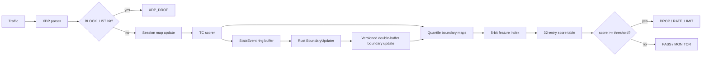
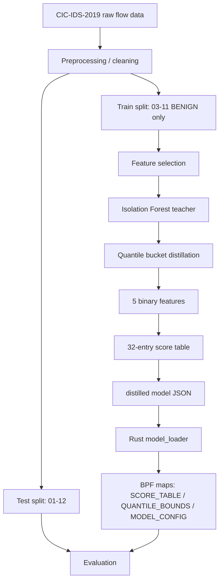
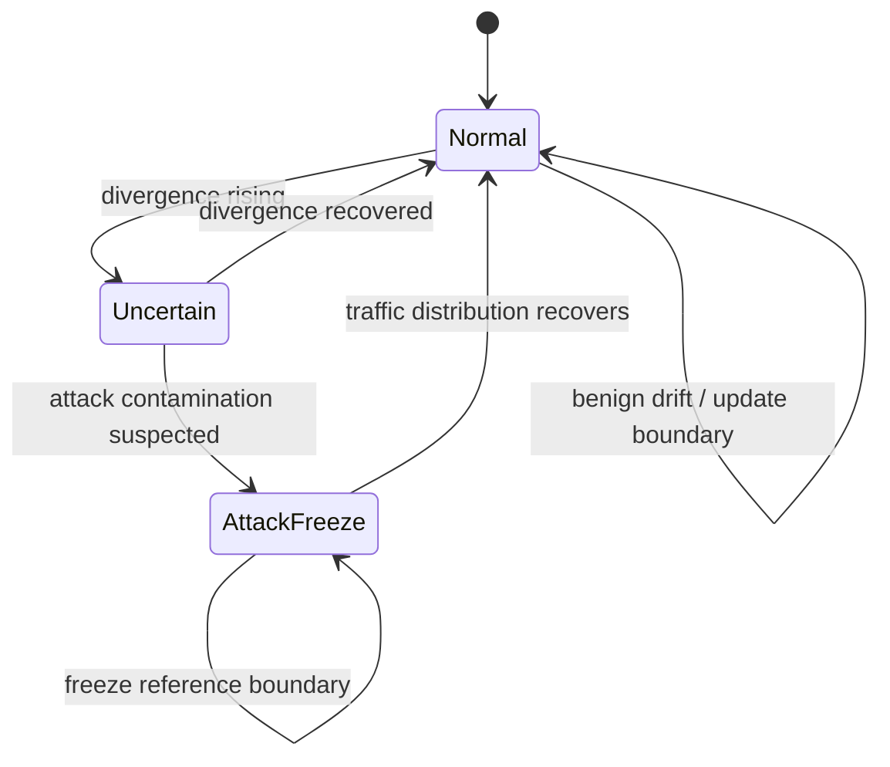
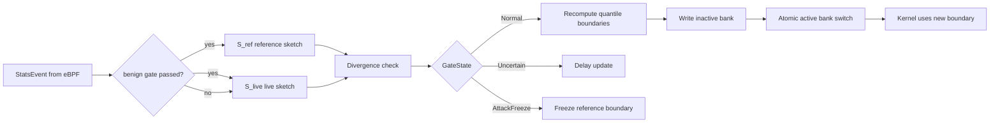

# 研究方法撰寫整理：eBPF DDoS 防禦專題

> 用途：提供給組員撰寫「研究方法」章節時使用。  
> 狀態：依目前文件與實作整理，重點對齊 `docs/TASKS.md`、`docs/_crosscut/kernel_defense_architecture.md`、`docs/_crosscut/kernel_model_contract.md`。  
> 注意：本文是寫作整理，不取代 canonical contract。若與 contract 文件衝突，以 contract 文件為準。

---

## 1. 研究主軸

本專題研究如何將 DDoS 偵測模型轉換為可在 Linux kernel datapath 中執行的輕量化防禦機制。核心問題不是單純追求最高 ML accuracy，而是要在 eBPF verifier 限制下，同時滿足：

1. 低延遲：封包處理路徑內完成推論與動作。
2. 可部署：模型邏輯能轉換為 eBPF 可接受的整數運算與 BPF map lookup。
3. 可更新：userspace 可依流量變化更新分位桶邊界，但不能被攻擊流量污染。
4. 可解釋：將偵測特徵、分位桶邊界、score table、threshold 明確定義成工程 contract。

建議論文或報告中的一句話主張：

> We propose a kernel-side DDoS mitigation pipeline that distills flow-level anomaly detection into quantile-bucket decisions executable by eBPF map lookups, while using userspace adaptive calibration to update boundaries under traffic drift.

---

## 2. 系統架構方法

### 2.1 Closed-loop control 架構

本系統可用閉環控制系統描述：

| 層級 | 對應實作 | 研究方法中的角色 |
|------|----------|------------------|
| 感測 Sensors | XDP / TC 收集 per-flow 統計 | 從封包萃取可被 kernel 整數化的流量特徵 |
| 決策 Decision | TC scorer + 5-bit score table | 將特徵映射成 bucket，再查表得到 anomaly score |
| 執行 Actuation | XDP_DROP / TC policy / BLOCK_LIST | 根據分數或規則執行 drop、限流或放行 |
| 回饋 Feedback | Rust userspace BoundaryUpdater | 根據低風險樣本與即時分布更新 quantile boundary |

目前實作狀態：

- 已實作 Layer 1：eBPF fast-path 推論。
- 已實作 Rust userspace logging 與 adaptive boundary update。
- 尚未實作 Layer 2 userspace 完整 Isolation Forest runtime inference。
- Python `service/model/` 目前是離線訓練、蒸餾與實驗 pipeline，不是 runtime inference path。

研究方法撰寫時必須清楚區分：

| 項目 | 現況 |
|------|------|
| eBPF fast-path inference | 已實作，是目前唯一 runtime 推論層 |
| Rust userspace | logging、map loading、adaptive boundary update |
| Python Isolation Forest | 離線 teacher / training / distillation，不在 runtime path |
| Layer 2 userspace full IF | 設計目標，尚未實作 |

### 2.2 每層寫作建議

撰寫研究方法時，建議每一層都按照「問題 → 設計選擇 → 實作方法 → 限制」的順序寫，避免只列程式功能。

| 層級 | 建議回答的問題 | 可以強調的設計選擇 | 避免誤寫 |
|------|----------------|----------------------|----------|
| 感測層 Sensors | 封包進來後收集哪些 flow statistics？為何這些特徵適合 DDoS？ | 使用 XDP / TC 維護 per-flow counter；特徵必須能整數化、低成本、跨流量環境較穩定 | 不要寫成使用完整 CICFlowMeter runtime；kernel 只維護必要統計 |
| 決策層 Decision | 如何把 flow statistics 轉成 anomaly decision？ | Isolation Forest 是 offline teacher；runtime 使用 quantile bucket + 5-bit index + 32-entry score table | 不要把 Run 25 IF-direct 寫成部署結果；目前部署 contract 是全二值化 table |
| 執行層 Actuation | 偵測後如何在 datapath 執行動作？ | XDP 適合快速 DROP / blocklist；TC 適合較完整的 per-flow scoring 與後續 policy | 不要宣稱完整 token bucket 限流策略已獨立成文；目前執行層文件仍待補 |
| 回饋層 Feedback | boundary 如何更新？如何避免被攻擊流量污染？ | Rust userspace 讀 StatsEvent，使用 dual-sketch + GateState + double-buffer hot update | 不要寫成重新訓練 IF；目前是更新 quantile boundary，不是 runtime retraining |
| 跨層 Contract | Python、Rust、eBPF 如何保持一致？ | 用 `kernel_model_contract.md` 固定 feature order、bit order、score scale、threshold comparison | 不要隱含 feature order；bit order 必須明確列出 |

各層可直接使用的寫作模板：

#### 感測層寫法

> The sensing layer extracts a compact set of flow-level statistics from packets using eBPF hooks. Instead of reproducing the full CICFlowMeter feature set in the kernel, the datapath maintains only the statistics required by the distilled contract, such as packet counts, packet length sums, squared length sums, and forward maximum packet length. This design reduces verifier complexity while preserving the information needed for quantile-bucket scoring.

中文可寫：

> 感測層並非在 kernel 中重現完整 CICFlowMeter，而是只維護部署 contract 需要的 flow statistics，例如封包數、封包長度總和、平方和與 forward maximum packet length。此設計降低 eBPF verifier 負擔，也讓特徵計算能維持在整數運算範圍內。

#### 決策層寫法

> The decision layer distills the Isolation Forest teacher into a quantile-bucket policy. Each selected feature is converted into a binary bucket bit, and the resulting 5-bit index is used to query a 32-entry score table stored in a BPF map. This replaces expensive tree traversal with constant-time map lookup.

中文可寫：

> 決策層將離線 Isolation Forest teacher 蒸餾為分位桶策略。每個特徵被轉成一個 bucket bit，五個 bit 組成 index 後查詢 32-entry score table，使 kernel runtime 不需要執行完整樹模型，而只需常數時間的 BPF map lookup。

#### 執行層寫法

> The actuation layer applies the decision directly in the datapath. XDP is used for early blocklist-based drops, while TC provides a later hook where per-flow statistics are sufficiently available for scoring. This separation allows the system to combine fast filtering with richer flow-based decisions.

中文可寫：

> 執行層將決策結果直接套用於 datapath。XDP 用於早期 blocklist drop，TC 則提供較後段的 hook，在 per-flow 統計較完整時執行 scoring。這種分層讓系統同時保留快速過濾與較完整的 flow-based decision。

#### 回饋層寫法

> The feedback layer updates quantile boundaries without retraining the teacher model. Rust userspace consumes sampled statistics from the kernel and maintains reference and live sketches. Boundary updates are published through versioned double-buffer maps, preventing inconsistent half-updated states in the datapath.

中文可寫：

> 回饋層不是重新訓練 teacher model，而是更新分位桶邊界。Rust userspace 讀取 kernel 取樣事件，維護 reference sketch 與 live sketch，並透過 versioned double-buffer maps 發布新 boundary，避免 datapath 讀到半更新狀態。

---

## 3. Dataset 與資料處理方法

### 3.1 Dataset 範圍

目前主評估範圍是 CIC-IDS-2019。

| 用途 | Dataset / Split | 說明 |
|------|------------------|------|
| Training normal boundary | CIC-IDS-2019 BENIGN only, 03-11 files | 用 benign flow 計算分位桶邊界 |
| Testing | CIC-IDS-2019, 01-12 files | 必須晚於 training，避免資料洩漏 |
| Cross-dataset generalization | BigFlow / IDS2018 | 技術路徑已預留，但目前不是主要評估範圍 |

資料時序原則：

- Train = 03-11，必須早於 Test = 01-12。
- 不可反轉 train/test；反轉屬於資料洩漏。
- IF training 與 quantile boundary 計算只能使用 BENIGN label，不可混入 attack label。

### 3.2 大檔案處理原則

資料檔案不可整份讀入記憶體。若需要讀 parquet，必須使用下列其中一種方式：

1. `columns=` 只讀必要欄位。
2. `pl.scan_parquet` lazy loading 後再 `.collect()`。
3. 使用既有 sampling function，例如 `get_normal_sample_from_files` 或 `get_balance_sample_from_files`。

原因：IDS2018 / BigFlow 單檔欄位數多，直接 `pl.read_parquet(big_file)` 容易 OOM。

---

## 4. 特徵工程方法

### 4.1 特徵選擇邏輯

研究方法可以描述成三階段：

1. 從 CICFlowMeter 原始流量特徵出發。
2. 用 offline feature selection 找出對 DDoS 偵測有貢獻的特徵。
3. 再依 eBPF verifier 限制，保留可整數化、可用 map lookup 表示的特徵。

歷史實驗重點：

| Run | 目的 | 結論 |
|-----|------|------|
| Run 01-07 | 特徵選擇 baseline | Run 07 找到較佳特徵組，AUC 約 0.9257 |
| Run 08-16 | 跨資料集與比例特徵探索 | 絕對值特徵跨環境不穩，需使用比例 / 無量綱特徵 |
| Run 17 | N=2 quantile bucket | 分位桶整數化證明 kernel-side 可行性 |
| Run 20-25 | Shape_q 替代與最終特徵 | FwdMax_q 取代 Shape_q，避免 Min Packet Length 退化成 protocol proxy |
| Run 28-29 | 部署 contract 對照 | 證明 IF-direct 證據模型與實際 32-entry score table 不能混用 |
| Run 30 | N-sweep | N=2 contract 平均 AUC 0.8943；N=4 無明顯改善，維持 N=2 |
| Run 31 | PAB-Score additive score | 不採用；additive avg AUC 0.7128，低於 N=2 contract |

### 4.2 目前部署特徵

目前 eBPF 實際 ship 的 contract 是 5 個全二值化特徵，N=2，32-entry table。

| Bit | Feature | 定義 | 類型 |
|----:|---------|------|------|
| 0 | `protocol` | L4 protocol bucket | absolute |
| 1 | `pkt_len_mean` | mean packet length bucket | absolute |
| 2 | `fwd_max_q` | Fwd Packet Length Max / Fwd Packet Length Mean | ratio |
| 3 | `sym_ratio` | Total Fwd Packets / Total Bwd Packets | ratio |
| 4 | `pkt_cv_sq` | squared packet length coefficient of variation | ratio |

Canonical index formula：

```text
index = (protocol_bit     << 0)
      | (pkt_len_mean_bit << 1)
      | (fwd_max_q_bit    << 2)
      | (sym_ratio_bit    << 3)
      | (pkt_cv_sq_bit    << 4)
```

分位桶比較使用交叉乘法，避免 kernel 浮點除法：

```text
a / b > numer / denom
<=> a * denom > b * numer
```

`pkt_cv_sq` 使用平方 CV，避免 sqrt：

```text
pkt_cv_sq = (pkt_len_sum_sq * total_pkts - total_pkt_len_sum^2)
            / total_pkt_len_sum^2
```

### 4.3 不再使用的特徵

`Shape_q = Min Packet Length / Fwd Packet Mean` 已棄用。

原因：CICFlowMeter 的 `Min Packet Length` 常被 TCP ACK payload=0 影響，使 TCP flow 的 min 接近 0，跨環境時容易退化成 protocol proxy，不具穩定辨識力。

---

## 5. 模型與蒸餾方法

### 5.1 Teacher model

Teacher model 使用 Isolation Forest。訓練原則：

- 只用 BENIGN flow 訓練。
- anomaly score 用於產生風險排序與分位桶策略。
- attack label 只用於 evaluation，不用於 teacher training。

### 5.2 Student / kernel-side model

完整 Isolation Forest 不適合直接放入 eBPF，原因包括：

- eBPF 不支援浮點運算。
- verifier 對 loop、stack、指令數有限制。
- 完整 IF 包含大量 tree node，難以在 kernel datapath 中安全執行。

因此本專題採用 distillation：

1. Offline Python pipeline 訓練或載入 Isolation Forest teacher。
2. 將特徵分成 quantile bucket。
3. 產生 5-bit index。
4. 建立 32-entry score table。
5. Rust userspace 載入 model JSON。
6. eBPF scorer 在 datapath 中用 map lookup 取得 score。

目前 contract：

| 項目 | 值 |
|------|----|
| feature count | 5 |
| bucket count | N=2 |
| index size | 5-bit |
| score table size | 32 entries |
| score scale | 10000 |
| threshold comparison | `>=` |

### 5.3 必須避免的錯誤敘述

撰寫研究方法時不要把 Run 25 IF-direct 結果當成部署結果。

正確說法：

- Run 25 是 evidence model，Protocol / Packet Length Mean 仍是 raw continuous value，屬於 IF-direct，不等於實際 eBPF contract。
- 實際部署 contract 是 Run 28/29 確認的 5-bit all-binary 32-entry score table。
- 部署 contract 在 HOIC 上已知失效，這是目前 Layer 1 fast-path 的限制。

可引用數字：

| Model | DDoS2019 | LOIC-HTTP | HOIC | LOIC-UDP | BigFlow | Avg |
|-------|---------:|----------:|-----:|---------:|--------:|----:|
| Run 25 IF-direct evidence | 0.8888 | 0.4744 | 0.8125 | 0.9959 | 0.8769 | 0.8097 |
| Actual 5-bit deployment contract | 0.8833 | 0.2647 | 0.0001 | 0.9969 | 0.8756 | 0.6041 |

若報告需要呈現目前較新的 CIC-only N-sweep，可使用 Run 30：

| Variant | Table size | Avg AUC | FPR | FNR | F1 |
|---------|-----------:|--------:|----:|----:|---:|
| N=2 baseline | 32 | 0.8943 | 0.1193 | 0.0176 | 0.9668 |
| N=4 all | 1024 | 0.8806 | 0.1246 | 0.0187 | 0.9629 |
| N=8 all | 32768 | 0.9125 | 0.0919 | 0.0191 | 0.9701 |

目前維持 N=2，原因：N=4 無顯著改善；N=8 雖 AUC 較高，但 table size = 32768，且後續 additive approximation Run 31 不採用。

---

## 6. eBPF 實作方法

### 6.1 Datapath 分工

| Hook | 職責 |
|------|------|
| XDP | 黑名單檢查、早期 DROP、封包解析與 per-flow 狀態更新 |
| TC | 分位桶推論、score lookup、統計事件輸出、後續 policy 動作 |
| Userspace Rust | 載入 BPF object、載入 model JSON、讀取 ring buffer、更新 BPF maps |

### 6.2 eBPF 限制與對應方法

| eBPF 限制 | 研究方法中的解法 |
|-----------|------------------|
| 無浮點運算 | 使用 fixed-point / integer ratio / cross multiplication |
| stack 512B 限制 | 避免大型 struct by-value；大型狀態放 BPF map |
| loop 需 bounded | N=2 使每特徵只需一次比較，避免複雜 loop |
| verifier 指令限制 | 避免完整 IF tree traversal，改用 score table lookup |
| runtime allocation 不可用 | 使用 BPF map 儲存 session、boundary、score table |

### 6.3 IPv4 / IPv6 handling

目前已實作 IPv4 / IPv6 雙棧解析：

- 位址統一為 `[u8; 16]`。
- IPv4 使用 IPv4-mapped IPv6 格式 `::ffff:a.b.c.d`。
- IPv6 固定 40-byte header。
- 目前不追 IPv6 extension header。
- SYN cookie 維持 IPv4-only，以 `pkt.is_ipv6` gate 區分。

---

## 7. Adaptive boundary update 方法

### 7.1 問題定義

DDoS 防禦不能只用 static boundary，因為正常流量會 drift；但如果 naive streaming update 直接使用所有當前流量，攻擊流量可能污染 boundary，使攻擊被校準成新常態。

因此本專題使用 gated dual-sketch update。

### 7.2 方法

| 元件 | 說明 |
|------|------|
| `S_ref` | reference sketch，只接收低風險、通過 benign gate 的樣本 |
| `S_live` | live sketch，接收所有當前樣本，反映即時分布 |
| `GateState` | 狀態機：Normal / Uncertain / AttackFreeze |
| `BoundaryMeta` | version、active bank、expiry_ns |
| double-buffer map | inactive bank 寫入完成後再切換 active bank，避免 half-update |

流程：

1. eBPF scorer 對封包或 flow 取樣，輸出 `StatsEvent`。
2. `StatsEvent.flags.bit0` 表示是否通過低風險 benign gate。
3. Rust `BoundaryUpdater` 更新 `S_ref` 與 `S_live`。
4. userspace 比較 live 與 reference divergence。
5. 若是正常 drift，更新 boundary。
6. 若疑似攻擊污染，進入 AttackFreeze，不更新 reference boundary。
7. 新 boundary 寫入 inactive bank，最後切換 active bank。
8. 若 boundary 過期，kernel 可 fallback 到 bank 0。

研究方法中可強調：

> Gated update separates benign traffic drift from attack contamination, reducing the risk of adapting the detector toward malicious distributions.

### 7.3 分位統計與流量偏移的寫作建議

這一段是本專題比較有研究味道的地方，建議不要只寫「系統會更新 boundary」，而要寫清楚「為什麼用分位數」、「流量偏移是什麼」、「為什麼 naive update 會危險」。

#### 7.3.1 建議寫作邏輯

可以按下列順序寫：

1. **Normal traffic is non-stationary**：正常流量不是固定分布，白天 / 晚上、尖峰 / 離峰、服務型態變化都會造成 packet length、flow symmetry、packet rate 改變。
2. **Static boundary degrades under drift**：如果 quantile boundary 永遠固定，正常流量偏移後可能被誤判為異常，造成 FPR 上升。
3. **Naive streaming update is vulnerable**：如果直接用所有 live traffic 更新 boundary，DDoS 攻擊流量會被納入新分布，使攻擊被校準成正常，造成 FNR 上升。
4. **Gated dual-sketch separates drift from contamination**：用 `S_ref` 追蹤可信 benign 樣本，用 `S_live` 追蹤當前整體分布，再用 divergence 與 GateState 決定是否更新。
5. **Versioned update preserves datapath consistency**：更新 boundary 時使用 double-buffer，避免 kernel 讀到一半新、一半舊的 boundary。

#### 7.3.2 核心概念怎麼解釋

| 概念 | 建議寫法 | 不建議寫法 |
|------|----------|------------|
| Quantile boundary | 將特徵值轉成相對位置，降低不同環境下絕對數值尺度差異 | 把 quantile 寫成單純 threshold trick |
| Traffic drift | 正常流量分布隨時間改變，不必然是攻擊 | 把所有分布變化都寫成 anomaly |
| Attack contamination | 攻擊流量混入 live statistics，導致 boundary 被推向攻擊分布 | 只寫「更新更即時」而不談污染風險 |
| Reference sketch | 可信低風險樣本形成的 baseline | 寫成全部歷史資料平均 |
| Live sketch | 當前流量觀測視窗 | 寫成新的 ground truth |
| GateState | 決定 update / delay / freeze 的保護機制 | 寫成一定會更新 boundary |

#### 7.3.3 可直接使用的中文段落

> 在實際網路環境中，正常流量分布並非固定不變。例如尖峰時段可能造成封包率與 flow size 上升，服務型態改變也可能影響 packet length mean 與 direction symmetry。若系統使用固定的分位桶邊界，這類 benign drift 可能導致正常流量被誤判為異常，使 false positive rate 上升。因此，本研究將分位桶邊界視為可校準的統計量，而非一次訓練後永久固定的 threshold。

> 然而，直接使用所有即時流量更新邊界也會帶來 attack contamination 問題。當 DDoS 攻擊流量佔比升高時，naive streaming update 可能把攻擊分布納入新的 normal boundary，使模型逐漸將攻擊校準為正常，造成 false negative rate 上升。為避免此問題，本研究採用 gated dual-sketch 設計：reference sketch 只接收通過 benign gate 的低風險樣本，live sketch 則追蹤當前整體流量分布。系統根據兩者的 divergence 判斷目前是 benign drift、uncertain transition，或 attack contamination，並分別執行 boundary update、延後更新或凍結 reference boundary。

> 此設計的重點不是重新訓練 Isolation Forest，而是在不改變 teacher model 的情況下，校準 kernel-side quantile boundary，使 eBPF fast-path 能在低成本 map lookup 架構下維持對流量漂移的適應能力。同時，boundary 發布採用 versioned double-buffer BPF maps：userspace 先寫入 inactive bank，再原子切換 active bank，避免 datapath 讀到 half-updated boundary。

#### 7.3.4 可直接使用的英文段落

> Real-world benign traffic is non-stationary. Packet rates, flow sizes, packet length distributions, and directional symmetry may change across peak hours or service workloads. A static quantile boundary may therefore become stale and incorrectly classify benign drift as anomalous traffic, increasing the false positive rate. We treat quantile boundaries as adaptive calibration parameters rather than fixed thresholds.

> However, updating boundaries with all live traffic is unsafe under DDoS attacks. When attack traffic dominates the observation window, a naive streaming update may shift the boundary toward the malicious distribution and gradually normalize the attack, increasing the false negative rate. To address this problem, we use a gated dual-sketch design. The reference sketch receives only low-risk samples that pass a benign gate, while the live sketch captures the current traffic distribution. The divergence between these sketches is used to distinguish benign drift from attack contamination and to decide whether to update, delay, or freeze boundary calibration.

> This feedback mechanism does not retrain the Isolation Forest teacher at runtime. Instead, it recalibrates the kernel-side quantile boundaries used by the distilled eBPF policy. Boundary updates are published through versioned double-buffer BPF maps, where userspace writes to an inactive bank and atomically switches the active bank after the update is complete. This prevents the datapath from observing inconsistent half-updated boundaries.

#### 7.3.5 實驗寫法建議

如果要把分位統計流量偏移寫成實驗，可以這樣描述：

| 實驗場景 | 操作方式 | 預期觀察 |
|----------|----------|----------|
| Static under benign drift | 固定 boundary，逐步提高 benign packet rate 或 flow size | FPR 上升 |
| Naive streaming under attack | 用所有 live samples 更新 boundary，逐步提高 attack ratio | FNR 上升，攻擊被校準成正常 |
| Gated dual-sketch | 只用 benign-gated samples 更新 reference | FPR / FNR 較穩定 |
| AttackFreeze | attack ratio 超過門檻或 divergence 過高 | boundary version 暫停更新 |
| Double-buffer update | 高速流量下持續更新 boundary | 不應出現 half-update 或 inconsistent decision |

可以呈現的圖：

```text
X-axis: time window 或 attack ratio
Y-axis: FPR / FNR / F1
Lines: Static boundary, Naive streaming, Gated dual-sketch
```

重點敘事：

> Static boundary fails when benign distribution shifts; naive streaming fails when attack traffic contaminates the update window; gated dual-sketch aims to preserve adaptability while preventing attack-induced boundary drift.

---

## 8. 實驗設計建議

### 8.1 最小必要實驗

如果時間有限，建議研究方法與結果章節聚焦四個實驗。

#### E1. Detection performance

目的：證明 teacher 與 distilled bucket policy 有偵測能力。

比較方法：

| Method | 說明 |
|--------|------|
| IF teacher | offline Isolation Forest baseline |
| 5-bit N=2 bucket contract | 目前 eBPF deployment contract |
| N=4 / N=8 ablation | 分析 bucket 數量與 table size trade-off |
| supervised baseline, optional | LR / RF，作為有 label 的上限參考 |

指標：

- ROC-AUC
- PR-AUC
- Precision
- Recall
- F1
- FPR
- FNR

#### E2. Contract fidelity / distillation loss

目的：回答「蒸餾後損失多少？」

比較軸：

| 比較 | 說明 |
|------|------|
| IF-direct vs 5-bit score table | 區分 evidence model 與 deployment contract |
| raw feature vs binary bucket | 量化二值化損失 |
| N=2 vs N=4 vs N=8 | 量化 table size 與 accuracy trade-off |

必須呈現 Run 28/29 caveat：Run 25 不是 deployment result。

#### E3. Adaptive boundary robustness

目的：證明 gated streaming update 比 static boundary 或 naive update 更安全。

比較方法：

| Method | Boundary update |
|--------|-----------------|
| Static boundary | 訓練後固定不變 |
| Naive streaming | 使用所有 live traffic 更新 |
| Gated dual-sketch | 只用低風險樣本更新 reference |

drift / contamination 場景：

- 正常流量 packet rate 放大 2x。
- 攻擊比例從 10% 增加到 50% 或 80%。
- 切成多個 time window，觀察 F1 / FNR / FPR 隨時間變化。

#### E4. System overhead

目的：證明 eBPF map lookup 適合 datapath。

比較方法：

| Method | 說明 |
|--------|------|
| No mitigation | 無防禦 baseline |
| static blocklist | 傳統 IP blocklist map lookup |
| userspace IF inference | 每 flow 或每 packet 送 userspace IF |
| eBPF bucket policy | 本專題方法 |

指標：

- throughput, pps
- CPU usage
- map lookup latency
- map update latency
- mitigation latency
- legitimate drop ratio

---

## 9. 報告中的研究方法章節建議結構

可直接依下列小節撰寫：

```text
3. Research Methodology
3.1 System Overview
3.2 Dataset and Preprocessing
3.3 Feature Selection under eBPF Constraints
3.4 Isolation Forest Teacher Model
3.5 Quantile-Bucket Distillation
3.6 Kernel-side eBPF Inference
3.7 Adaptive Boundary Calibration
3.8 Evaluation Metrics and Experimental Setup
```

每節應放的重點：

| 小節 | 重點內容 |
|------|----------|
| 3.1 | XDP → TC → Rust userspace closed-loop 架構 |
| 3.2 | CIC-IDS-2019、BENIGN-only training、正確 train/test 時序 |
| 3.3 | 為何從原始特徵縮到 eBPF 可行的 5 features |
| 3.4 | IF teacher 只用 benign training，attack label 只做 evaluation |
| 3.5 | quantile bucket、5-bit index、32-entry score table |
| 3.6 | integer comparison、BPF map lookup、verifier 限制 |
| 3.7 | dual-sketch、GateState、double-buffer hot update |
| 3.8 | AUC、F1、FPR/FNR、throughput、latency、CPU usage |

---

## 10. 可直接使用的研究方法段落草稿

### 10.1 中文版

本研究提出一個可部署於 Linux kernel datapath 的 DDoS 偵測與緩解方法。整體系統採用 closed-loop control 架構，包含感測、決策、執行與回饋四個階段。感測層由 eBPF XDP/TC hooks 解析封包並維護 per-flow 統計；決策層將 flow-level 特徵映射至分位桶，形成 5-bit index 後查詢 32-entry score table；執行層根據查表結果進行封包放行、監控或丟棄；回饋層則由 Rust userspace 根據低風險樣本週期性更新分位桶邊界，並透過 versioned double-buffer BPF maps 實現不中斷的 hot update。

在模型設計上，本研究以 Isolation Forest 作為離線 teacher model，僅使用 BENIGN flow 進行訓練，以避免攻擊標籤污染 anomaly boundary。由於完整 Isolation Forest 不適合直接部署於 eBPF datapath，本研究將 teacher 的 decision behavior 蒸餾為 quantile-bucket policy。具體而言，系統選用五個可整數化且可於 kernel 中計算的特徵：protocol、packet length mean、forward packet maximum ratio、direction symmetry ratio，以及 squared packet length coefficient of variation。每個特徵被二值化為一個 bucket bit，組成 5-bit index，並以 BPF array map 儲存 32-entry score table。

為符合 eBPF verifier 限制，本研究避免浮點數、動態記憶體與複雜迴圈。所有比例特徵皆以交叉乘法取代除法與浮點比較，例如將 `a / b > numer / denom` 轉換為 `a * denom > b * numer`。此設計使 kernel fast-path 僅需執行少量整數運算與 BPF map lookup，即可完成 anomaly score 推論。

為處理正常流量分布漂移，本研究進一步設計 gated dual-sketch adaptive boundary update。系統同時維護 reference sketch 與 live sketch：reference sketch 只接收通過 benign gate 的低風險樣本，live sketch 則反映當前整體流量分布。當兩者差異符合正常 drift 條件時，userspace 重新計算 boundary 並寫入 inactive map bank；若差異顯示可能遭受攻擊污染，系統進入 AttackFreeze 狀態並暫停更新 reference boundary。此方法避免 naive streaming update 將攻擊流量誤校準為正常流量。

### 10.2 English version

This study proposes a kernel-deployable DDoS detection and mitigation pipeline based on eBPF. The system follows a closed-loop control architecture consisting of sensing, decision making, actuation, and feedback. The sensing layer extracts per-flow statistics using XDP and TC hooks. The decision layer maps flow features into quantile buckets and constructs a 5-bit index to query a 32-entry score table. The actuation layer enforces pass, monitor, rate-limit, or drop decisions in the datapath. The feedback layer runs in Rust userspace and adaptively recalibrates quantile boundaries through versioned double-buffer BPF maps.

We use Isolation Forest as an offline teacher model trained only on benign flows. Since a full Isolation Forest is not suitable for direct execution in the eBPF datapath, we distill its decision behavior into a quantile-bucket policy. The deployed contract uses five kernel-computable features: protocol, packet length mean, forward packet maximum ratio, direction symmetry ratio, and squared packet length coefficient of variation. Each feature is binarized into one bucket bit, forming a 5-bit index for a 32-entry score table stored in a BPF array map.

To satisfy eBPF verifier constraints, the design avoids floating-point operations, dynamic memory allocation, and complex loops. Ratio comparisons are implemented using cross multiplication, replacing `a / b > numer / denom` with `a * denom > b * numer`. As a result, the kernel fast path performs only integer arithmetic and BPF map lookups for anomaly scoring.

To handle traffic drift without being contaminated by attack traffic, we introduce a gated dual-sketch adaptive boundary update mechanism. A reference sketch receives only low-risk samples that pass a benign gate, while a live sketch tracks the current traffic distribution. When the divergence indicates benign drift, userspace recomputes the quantile boundaries and publishes them through an inactive map bank before atomically switching the active bank. When the divergence suggests attack contamination, the system enters an AttackFreeze state and prevents the malicious distribution from updating the reference boundary.

---

## 11. 圖表建議

### Figure 1: System architecture

建議畫法：

```text
Traffic
  -> XDP parser / blocklist
  -> per-flow session map
  -> TC scorer
  -> quantile boundary maps
  -> 5-bit index
  -> 32-entry score table
  -> action
  -> StatsEvent ring buffer
  -> Rust BoundaryUpdater
  -> versioned boundary hot update
```

Mermaid 版本：



### Figure 1b: Offline training and distillation pipeline



### Figure 1c: Adaptive boundary feedback loop





### Figure 1d: Deployment contract bit-index construction

```mermaid
flowchart TD
    A[protocol] --> A1[protocol_bit]
    B[pkt_len_mean] --> B1[pkt_len_mean_bit]
    C[fwd_max_q] --> C1[fwd_max_q_bit]
    D[sym_ratio] --> D1[sym_ratio_bit]
    E[pkt_cv_sq] --> E1[pkt_cv_sq_bit]

    A1 --> F[bit 0]
    B1 --> G[bit 1]
    C1 --> H[bit 2]
    D1 --> I[bit 3]
    E1 --> J[bit 4]

    F --> K[5-bit index]
    G --> K
    H --> K
    I --> K
    J --> K
    K --> L[SCORE_TABLE[index]]
    L --> M{score >= threshold}
    M -- yes --> N[attack-like action]
    M -- no --> O[benign-like action]
```

### Table 1: Detection performance

欄位建議：

```text
Method | Dataset | ROC-AUC | PR-AUC | Precision | Recall | F1 | FPR | FNR
```

### Table 2: System overhead

欄位建議：

```text
Method | Throughput | CPU usage | Lookup latency | Update latency | Mitigation latency
```

### Figure 2: Drift / contamination robustness

X-axis：time window 或 attack ratio。  
Y-axis：F1、FNR 或 FPR。  
Lines：Static、Naive streaming、Gated dual-sketch。

---

## 12. 專題報告「研究方法」章節每段要寫什麼

這一節是給組員寫專題報告用，不是簡報投影片。建議把研究方法寫成 8 個小節，每個小節 1-3 段，搭配 2-3 張圖與 2 張表。重點是把「為什麼這樣設計」寫出來，而不是只列出程式做了什麼。

### 12.1 建議章節結構

```text
3. 研究方法
3.1 系統總覽與研究流程
3.2 資料集與前處理
3.3 eBPF 限制下的特徵工程
3.4 Isolation Forest Teacher Model
3.5 Quantile-Bucket Distillation
3.6 Kernel-side eBPF Inference
3.7 Adaptive Boundary Calibration
3.8 評估方法與指標
```

### 12.2 每一節要寫什麼

| 報告小節 | 這節要回答的問題 | 建議內容 | 建議圖表 |
|----------|------------------|----------|----------|
| 3.1 系統總覽與研究流程 | 本研究方法整體如何運作？ | 說明 closed-loop control：感測、決策、執行、回饋；交代 XDP、TC、Rust userspace、Python offline pipeline 的分工 | Figure 1 系統架構圖 |
| 3.2 資料集與前處理 | 實驗資料怎麼切？如何避免 data leakage？ | CIC-IDS-2019；Train=03-11 BENIGN only；Test=01-12；attack label 只做 evaluation；大檔案 column-pruning | Table 1 Dataset split |
| 3.3 eBPF 限制下的特徵工程 | 為什麼不是直接用完整 ML 特徵？ | 說明 eBPF 無浮點、bounded loop、512B stack；因此選可整數化的 5 個特徵；說明 Shape_q 棄用與 FwdMax_q 替代 | Table 2 Feature contract |
| 3.4 Isolation Forest Teacher Model | IF 在方法中扮演什麼角色？ | 說明 IF 是 offline teacher；只用 BENIGN training；輸出 anomaly score / ranking；不直接進 kernel runtime | 可放 teacher/student 流程圖 |
| 3.5 Quantile-Bucket Distillation | 如何把 IF 轉成 eBPF 可執行模型？ | 說明 quantile boundary、binary bucket、5-bit index、32-entry score table、threshold comparison；強調 Run 25 不是部署結果 | Figure 2 Distillation pipeline |
| 3.6 Kernel-side eBPF Inference | eBPF datapath 如何完成推論？ | 說明 XDP blocklist / parser、TC scorer、BPF map lookup、交叉乘法替代浮點除法 | Figure 3 Kernel datapath |
| 3.7 Adaptive Boundary Calibration | 流量偏移時如何更新 boundary？ | 說明 traffic drift、attack contamination、S_ref / S_live、GateState、double-buffer hot update | Figure 4 Feedback loop |
| 3.8 評估方法與指標 | 如何證明方法有效？ | Detection metrics：AUC、PR-AUC、F1、FPR、FNR；System metrics：throughput、CPU、lookup latency、update latency；Robustness：drift / contamination | Table 3 Evaluation metrics |

### 12.3 各小節可直接照著寫的段落規劃

#### 3.1 系統總覽與研究流程

第一段：交代研究目標。

> 本研究目標是將 flow-level anomaly detection 轉換為可部署於 Linux kernel datapath 的輕量化 DDoS 防禦方法。不同於傳統將完整機器學習模型放在 userspace 執行的方式，本研究將 offline teacher model 的決策行為蒸餾為 eBPF 可執行的 quantile-bucket policy，使封包在 XDP / TC 路徑中即可完成快速決策。

第二段：交代系統分層。

> 系統採用 closed-loop control 架構，包含感測、決策、執行與回饋四層。感測層由 XDP / TC hooks 維護 per-flow statistics；決策層以 quantile boundary 將特徵轉為 5-bit index 並查詢 score table；執行層根據 score 執行 pass、monitor、rate-limit 或 drop；回饋層由 Rust userspace 根據 kernel 取樣事件更新 boundary。

第三段：交代現況限制。

> 目前 runtime 推論層僅包含 eBPF fast-path。Python Isolation Forest pipeline 用於離線訓練與蒸餾，尚未接入 runtime userspace inference。因此報告中應將 Python model 視為 teacher / experiment pipeline，而非線上推論服務。

#### 3.2 資料集與前處理

第一段：說明 dataset。

> 本研究目前以 CIC-IDS-2019 作為主要評估資料集，並使用 BENIGN traffic 建立 normal boundary。為避免資料洩漏，訓練資料使用時間較早的 03-11 files，測試資料使用時間較晚的 01-12 files。

第二段：說明 training label policy。

> Isolation Forest teacher 與 quantile boundary calculation 只使用 BENIGN flows。Attack labels 僅用於 evaluation 階段計算 AUC、F1、FPR 與 FNR，不參與 teacher training 或 normal boundary estimation。

第三段：說明大資料處理。

> 由於 flow dataset 欄位多且檔案大，資料處理採用 column pruning 與 per-file sampling，避免一次讀入完整 parquet 造成記憶體耗盡。

#### 3.3 eBPF 限制下的特徵工程

第一段：先講限制。

> eBPF datapath 不適合直接使用完整 CICFlowMeter feature set。Kernel 中不能使用浮點運算，loop 必須 bounded，stack 只有 512B，且所有狀態需透過 BPF maps 或小型 stack value 維護。因此特徵選擇除了考慮偵測效果，也必須考慮 verifier compatibility。

第二段：講 5 個特徵。

> 最終部署 contract 使用五個可在 kernel 中計算或查表的特徵：protocol、packet length mean、forward maximum packet length ratio、direction symmetry ratio，以及 squared packet length coefficient of variation。這些特徵分別捕捉 L4 protocol、封包大小、前向封包分散度、雙向流量不對稱，以及封包長度變異性。

第三段：講 Shape_q 棄用。

> 早期設計中的 Shape_q 使用 Min Packet Length / Fwd Packet Mean，但 Min Packet Length 容易受到 TCP ACK payload=0 影響，跨環境時退化成 protocol proxy。因此目前改以 FwdMax_q 取代 Shape_q。

#### 3.4 Isolation Forest Teacher Model

第一段：說明 teacher。

> 本研究使用 Isolation Forest 作為離線 teacher model。IF 適合 anomaly detection，因為它不需要攻擊樣本即可從 BENIGN distribution 中學習正常流量型態，並對偏離正常分布的 flow 給予較高 anomaly score。

第二段：說明不直接部署。

> 完整 IF 包含多棵樹與大量節點，不適合直接放入 eBPF kernel datapath。若在 userspace 對每個 flow 執行 IF inference，也會增加封包處理延遲。因此本研究將 IF 視為 offline teacher，用於產生 distillation target，而不是 runtime model。

#### 3.5 Quantile-Bucket Distillation

第一段：說明蒸餾目的。

> Quantile-bucket distillation 的目標，是將 IF teacher 的 anomaly ranking 轉換為 eBPF 可執行的 score table。每個特徵被二值化為 bucket bit，五個 bit 組成 index 後查詢 32-entry score table。

第二段：說明 contract。

> 部署 contract 採用 N=2、5-feature、32-entry table。Index 的 bit order 固定為 protocol、pkt_len_mean、fwd_max_q、sym_ratio、pkt_cv_sq。Rust loader 與 eBPF scorer 必須依相同 feature order 解讀 model JSON，避免 Python、Rust、kernel 三者語意不一致。

第三段：說明 caveat。

> 報告中必須區分 IF-direct evidence model 與 deployment contract。Run 25 的 IF-direct 結果不能視為 eBPF 實際部署結果；實際部署結果應以 5-bit all-binary score table 的 contract 評估為準。

#### 3.6 Kernel-side eBPF Inference

第一段：說明 datapath。

> Runtime datapath 分為 XDP 與 TC。XDP 負責早期封包解析、blocklist drop 與 session state update；TC 則在 flow statistics 較完整後執行 quantile scoring 與 policy decision。

第二段：說明整數化。

> 為避免 eBPF 浮點運算，所有 ratio feature 都轉換為交叉乘法。例如 `a / b > numer / denom` 會被改寫為 `a * denom > b * numer`。因此 kernel fast-path 只需要整數運算與 BPF map lookup。

第三段：說明效能意義。

> 此設計將原本昂貴的 tree traversal 轉換為常數時間 score lookup，使防禦邏輯能放在 datapath 中執行，降低 mitigation latency。

#### 3.7 Adaptive Boundary Calibration

第一段：說明 traffic drift。

> 真實正常流量分布會隨時間改變。若 quantile boundary 固定不變，benign drift 可能造成正常流量被誤判，使 FPR 上升。

第二段：說明 attack contamination。

> 但若直接用所有 live traffic 更新 boundary，DDoS 攻擊流量可能污染 normal boundary，使攻擊被校準成正常，導致 FNR 上升。

第三段：說明方法。

> 因此本研究採用 gated dual-sketch。`S_ref` 只接收通過 benign gate 的低風險樣本，`S_live` 追蹤當前整體流量分布。系統根據兩者 divergence 進入 Normal、Uncertain 或 AttackFreeze，決定更新、延後或凍結 boundary。Boundary 發布則使用 versioned double-buffer map，避免 half-update。

#### 3.8 評估方法與指標

第一段：說明 detection metrics。

> 偵測效果使用 ROC-AUC、PR-AUC、Precision、Recall、F1、FPR 與 FNR 評估。DDoS 防禦不能只看 accuracy，因為 false positive 會誤傷正常流量，false negative 則代表攻擊漏放。

第二段：說明 system metrics。

> 系統效能使用 packet throughput、CPU usage、map lookup latency、map update latency 與 mitigation latency 評估，以證明 eBPF score table lookup 相較 userspace IF inference 更適合 datapath。

第三段：說明 robustness metrics。

> Boundary calibration 的穩定性可透過 drift / contamination experiment 觀察。報告可比較 static boundary、naive streaming update 與 gated dual-sketch 在不同 time window 或 attack ratio 下的 FPR、FNR 與 F1 變化。

### 12.4 專題報告建議圖表配置

| 圖表 | 放在哪一節 | 目的 | 內容 |
|------|------------|------|------|
| Figure 1 System Architecture | 3.1 | 讓讀者一次看懂系統 | Offline pipeline、XDP/TC datapath、Rust feedback loop |
| Figure 2 Quantile-Bucket Distillation | 3.5 | 說明 teacher 如何變成 kernel table | IF teacher → bucket bits → 5-bit index → score table |
| Figure 3 Adaptive Boundary Loop | 3.7 | 說明流量偏移與污染防護 | StatsEvent → S_ref/S_live → GateState → double-buffer update |
| Table 1 Dataset Split | 3.2 | 防止資料切分被質疑 | Train/test 日期、label usage、用途 |
| Table 2 Feature Contract | 3.3 / 3.5 | 固定 feature semantics | feature name、definition、bit position、kernel calculation |
| Table 3 Evaluation Metrics | 3.8 | 說明如何驗證 | detection、system overhead、robustness metrics |

---

## 13. 組員分工建議

| 角色 | 負責內容 | 對應文件 |
|------|----------|----------|
| Dataset / ML | dataset、preprocessing、IF teacher、feature selection | `docs/1_sensing/feature_selection_log.md` |
| Distillation | quantile bucket、score table、Run 28-31 分析 | `docs/2_decision/quantile_bucket_strategy_log.md` |
| Kernel / eBPF | XDP/TC、verifier constraints、integer implementation | `docs/_crosscut/kernel_defense_architecture.md` |
| Userspace / Feedback | model loader、BoundaryUpdater、double-buffer update | `docs/4_feedback/boundary_adaptive_update_plan.md` |
| Evaluation | detection metrics、system overhead、tables and figures | `docs/TASKS.md` 論文實驗計畫 |

---

## 13. 寫作注意事項

1. 不要把 Run 25 IF-direct 數字寫成實際部署結果。
2. 不要說目前 runtime 有完整 userspace Isolation Forest；目前沒有。
3. 不要說 Shape_q 是目前特徵；目前用 FwdMax_q。
4. 不要說目前主要評估已啟用 Mixed BENIGN；目前範圍是 CIC-IDS-2019 only，Mixed BENIGN 是跨資料集泛化時的預留路徑。
5. 不要說 N=4 是目前 contract；目前 contract 是 N=2、5-bit、32-entry table。
6. 若討論 BigFlow / IDS2018，需標註是 cross-dataset generalization，不是目前主要部署評估範圍。
7. 若討論 Layer 2 userspace full IF，必須標註為未實作設計目標。
8. 若討論 eBPF release deployment，需確認 `make build-ebpf` 與 on-hardware verifier load 狀態；build 成功不等於 verifier/runtime 成功。

---

## 14. 主要參考文件

| 文件 | 用途 |
|------|------|
| `docs/TASKS.md` | 目前功能完成度、論文實驗計畫、待辦狀態 |
| `docs/_crosscut/kernel_defense_architecture.md` | 架構、數學模型、eBPF verifier 限制、部署 caveat |
| `docs/_crosscut/kernel_model_contract.md` | 5-feature N=2 score table contract、bit order、feature definition |
| `docs/1_sensing/feature_selection_log.md` | feature selection 歷史與 Run 01-26 證據鏈 |
| `docs/2_decision/quantile_bucket_strategy_log.md` | quantile bucket、Run 17/28/29/30/31 實驗 |
| `docs/4_feedback/boundary_adaptive_update_plan.md` | adaptive boundary、dual-sketch、GateState、double-buffer update |
| `docs/claude_ref/dev_commands.md` | 驗證命令與資料路徑 |

---

## 15. 最短版研究方法摘要

若組員只需要一段簡短版，可使用以下版本：

> 本研究以 eBPF 實作低延遲 DDoS 偵測與緩解管線。離線階段使用 CIC-IDS-2019 BENIGN flows 訓練 Isolation Forest teacher，並將其 decision behavior 蒸餾為可在 kernel 中執行的 quantile-bucket score table。部署階段由 XDP/TC hooks 萃取 per-flow 統計，計算五個可整數化特徵，二值化為 5-bit index 後查詢 32-entry BPF score table。為避免 eBPF 不支援浮點與複雜模型推論，所有比例比較皆轉換為整數交叉乘法。系統同時透過 Rust userspace 讀取 kernel 統計事件，使用 gated dual-sketch 判斷正常 drift 與攻擊污染，並以 versioned double-buffer BPF maps 熱更新 quantile boundaries。評估部分比較 IF teacher、bucket-distilled policy 與不同 bucket 數量設定，在 detection metrics 與 system overhead 兩個面向驗證模型有效性與 kernel deployment efficiency。
